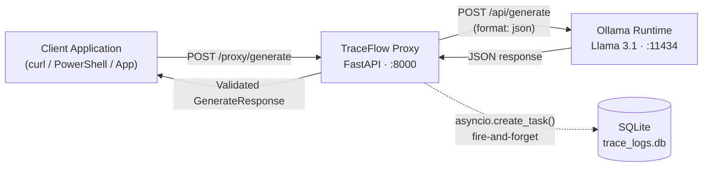
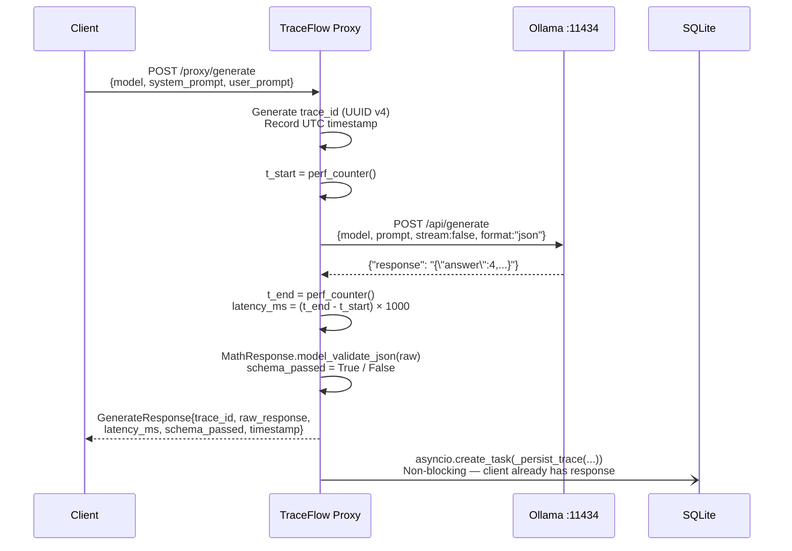
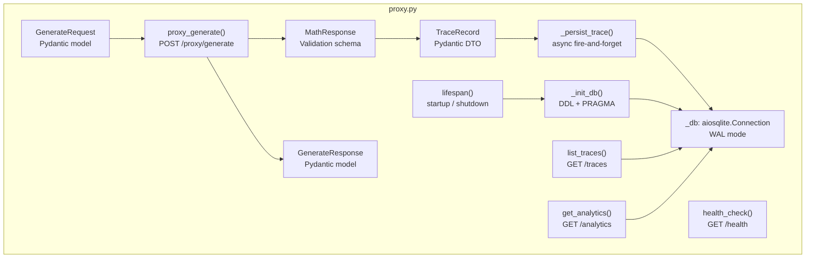
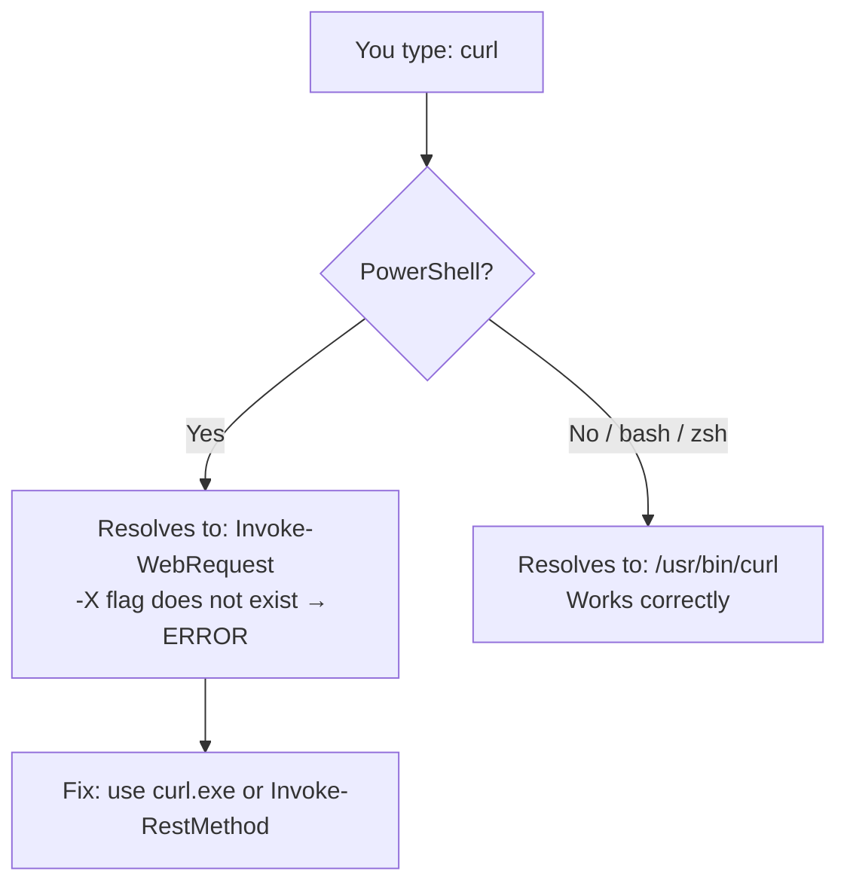
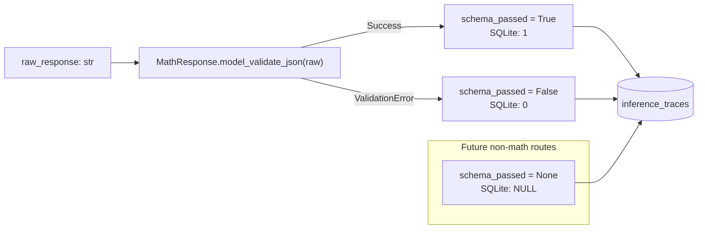

# TraceFlow Proxy

> **Lightweight observability middleware for local LLM deployments.**  
> Intercepts every Ollama generation request, measures inference latency at nanosecond precision, validates the response against a deterministic Pydantic schema, and persists a full structured trace to a local SQLite database — all in a single Python file with zero cloud dependencies.

---

## Table of Contents

1. [What Is TraceFlow Proxy?](#1-what-is-traceflow-proxy)
2. [Architecture](#2-architecture)
3. [Project History — What Broke, Why, and How It Was Fixed](#3-project-history--what-broke-why-and-how-it-was-fixed)
4. [File Structure](#4-file-structure)
5. [SQLite Schema](#5-sqlite-schema)
6. [API Reference](#6-api-reference)
7. [Setup & Running](#7-setup--running)
8. [Correct PowerShell Usage](#8-correct-powershell-usage)
9. [Data Flow Deep Dive](#9-data-flow-deep-dive)
10. [Design Principles](#10-design-principles)
11. [Roadmap](#11-roadmap)

---

## 1. What Is TraceFlow Proxy?

TraceFlow Proxy is a **single-file FastAPI application** that sits transparently between any client application and a locally running [Ollama](https://ollama.com/) LLM instance. Instead of calling Ollama directly, clients call the proxy, which:

1. **Intercepts** the request
2. **Forwards** it to Ollama with a high-precision timer running
3. **Validates** the response against a strict Pydantic schema
4. **Logs** a complete trace (prompts, response, latency, pass/fail) to SQLite asynchronously
5. **Returns** the structured result to the caller immediately — without waiting for the DB write

The result is a **permanent, queryable audit trail** of every LLM interaction, with a built-in hallucination detection metric (`schema_passed`) and an analytics endpoint that surfaces aggregate performance data in real-time.

**Stack:**

| Layer | Technology |
|---|---|
| API Framework | FastAPI + Uvicorn |
| Async HTTP Client | httpx |
| Schema Validation | Pydantic v2 |
| Database | SQLite via aiosqlite |
| LLM Backend | Ollama (Llama 3.1) |
| Runtime | Python ≥ 3.11 |

---

## 2. Architecture

### System Overview



### Request Lifecycle



### Internal Component Map



---

## 3. Project History — What Broke, Why, and How It Was Fixed

This project was built iteratively across three phases. Each phase introduced problems that required diagnosis and a deliberate fix.

---

### Phase 1 — Initial Build (`v0.1`)

**Goal:** Build the core proxy with latency measurement and SQLite logging.

**What was built:**
- Single-file FastAPI app with `POST /proxy/generate`, `GET /health`, `GET /traces`
- High-precision latency timer using `time.perf_counter()`
- Async fire-and-forget DB write via `asyncio.create_task()`
- SQLite with WAL journal mode for concurrent-safe reads during writes

**No breaks in this phase.** The architecture was sound from the start. The key non-obvious decision was using `asyncio.create_task()` for the DB write rather than `await _persist_trace()` — this ensures the client receives their response in the same millisecond the Ollama response arrives, and the DB write happens concurrently on the same event loop without blocking.

---

### Phase 2 — Environment Setup & PowerShell Curl Failure (`v0.2 / v0.2.1`)

**Two separate issues were encountered.**

#### Issue 1: Missing Virtual Environment

**What broke:** Dependencies were installed globally, risking version conflicts with other Python projects on the machine.

**Root cause:** No virtual environment was created before `pip install`.

**Fix:**
```powershell
python -m venv .venv
.venv\Scripts\Activate.ps1
.venv\Scripts\pip install -r requirements.txt
```

The `.venv/` directory was already excluded from git via a pre-existing entry in `.gitignore`.

---

#### Issue 2: `ollama serve` Bind Error

**What broke:**
```
Error: listen tcp 127.0.0.1:11434: bind: Only one usage of each socket
address (protocol/network address/port) is normally permitted.
```

**Root cause:** This was **not an error** — Ollama was already running from a previous session. The OS correctly refused to bind a second process to the same port.

**Fix:** No action needed. The proxy connects to the already-running Ollama instance. Confirmed with:
```powershell
curl.exe http://localhost:11434/api/tags
```

---

#### Issue 3: PowerShell `curl` Alias Incompatibility

**What broke:**
```powershell
curl -X POST http://localhost:8000/proxy/generate \
  -H "Content-Type: application/json" \
  -d '{"model":"llama3.1",...}'
```
```
Invoke-WebRequest : A parameter cannot be found that matches parameter name 'X'.
```

**Root cause:** PowerShell aliases `curl` to `Invoke-WebRequest`, a completely different cmdlet with different flag syntax. The `-X`, `-H`, and `-d` flags are Unix `curl` conventions — they do not exist on `Invoke-WebRequest`.

Additionally, the `\` line-continuation character is a bash/zsh convention. PowerShell uses the backtick `` ` `` character.

**Fix — Three working alternatives:**

**Option A: `curl.exe`** — Bypass the alias by calling the real binary directly:
```powershell
curl.exe -X POST http://localhost:8000/proxy/generate `
  -H "Content-Type: application/json" `
  -d '{\"model\":\"llama3.1\",\"system_prompt\":\"You are helpful.\",\"user_prompt\":\"What is 2+2?\"}'
```

**Option B: `Invoke-RestMethod`** — Native PowerShell, no escaping:
```powershell
Invoke-RestMethod -Method POST `
  -Uri "http://localhost:8000/proxy/generate" `
  -ContentType "application/json" `
  -Body '{"model":"llama3.1","system_prompt":"You are helpful.","user_prompt":"What is 2+2?"}'
```

**Option C: Hashtable + `ConvertTo-Json`** — Cleanest for complex payloads:
```powershell
$body = @{
    model         = "llama3.1"
    system_prompt = "You are helpful."
    user_prompt   = "What is 2+2?"
} | ConvertTo-Json

Invoke-RestMethod -Method POST `
  -Uri "http://localhost:8000/proxy/generate" `
  -ContentType "application/json" `
  -Body $body
```

**Why this matters:** PowerShell ships with `Invoke-WebRequest` aliased as both `curl` and `wget`. Any script copied from Linux/macOS documentation will silently fail in a PowerShell session. Always use `curl.exe` or native PowerShell cmdlets.

---

#### Phase 2.1 — Schema Validation (`v0.2.1`)

**Goal:** Detect when the LLM hallucinates by checking if its output conforms to an expected JSON structure.

**Problem with naive approach:** Asking the model to "respond in JSON" via the system prompt is unreliable. Instruction-following is probabilistic — the model can and will produce free-text responses, malformed JSON, or JSON with wrong types under certain conditions.

**Fix — Two-layer enforcement:**

**Layer 1: Runtime-level JSON constraint (`"format": "json"`)**
```python
ollama_body: dict = {
    "model": payload.model,
    "prompt": ollama_prompt,
    "stream": False,
    "format": "json",   # Constrains the sampler — not a prompt instruction
}
```
The `format: json` parameter instructs Ollama's token sampler to only emit tokens that form valid JSON. This is enforced at the **model runtime level** — the model physically cannot produce non-JSON output when this flag is set.

**Layer 2: Pydantic schema validation**
```python
class MathResponse(BaseModel):
    answer: int          # Must be integer — "four" → ValidationError
    explanation: str     # Must be present — {} → ValidationError

try:
    MathResponse.model_validate_json(raw_response)
    schema_passed = True
except ValidationError:
    schema_passed = False   # Structural drift recorded — raw_response preserved
```

Even with `format: json`, the model can produce `{"answer": "four"}` — valid JSON, wrong type. Pydantic's `model_validate_json()` catches this. The raw (flawed) response is **always retained** in the trace for audit purposes, never overwritten or discarded.

**Validation matrix:**

| Ollama Output | `schema_passed` | Reason |
|---|---|---|
| `{"answer": 4, "explanation": "2+2=4"}` | `true` | Perfect conformance |
| `{"answer": 4.0, "explanation": "..."}` | `true` | Pydantic coerces `4.0` → `int` |
| `{"answer": "four", "explanation": "..."}` | `false` | String not coercible to `int` |
| `{"answer": 4}` | `false` | Missing required `explanation` field |
| `The answer is 4.` | `false` | Not valid JSON |
| `{}` | `false` | Both required fields missing |

---

### Phase 3 — Analytics Endpoint (`v0.3 / v0.3.1`)

**Goal:** Surface aggregate metrics from the SQLite log without requiring a separate analytics tool.

**Design challenge:** The `schema_passed` column has three states — `1` (True), `0` (False), and `NULL` (not evaluated). A naive `AVG(schema_passed)` would incorrectly include `NULL` rows in the denominator (Phase 1 traces), producing a misleading pass rate.

**Fix — Explicit CASE-based aggregation:**
```sql
SELECT
    COUNT(*)                                            AS total_inferences,
    AVG(latency_ms)                                     AS average_latency_ms,
    SUM(CASE WHEN schema_passed = 1 THEN 1 ELSE 0 END) AS pass_count,
    SUM(CASE WHEN schema_passed = 0 THEN 1 ELSE 0 END) AS fail_count,
    SUM(CASE WHEN schema_passed IS NULL THEN 1 ELSE 0 END) AS null_count
FROM inference_traces
```

- All five aggregates computed in **one SQL statement** — one `aiosqlite` await, one cursor allocation, one full-table scan
- `schema_pass_rate` is computed in Python from `pass_count / (pass_count + fail_count)` — `null_count` is intentionally excluded from the denominator
- Empty database returns `null` for `average_latency_ms` and `schema_pass_rate` (not `0`, which would be misleading)

---

## 4. File Structure

```
TraceFlow Prox/
├── proxy.py               ← Entire application (510 lines, 0 external cloud deps)
├── requirements.txt       ← Pinned dependencies
├── .gitignore             ← Excludes DB, .venv, Reports, __pycache__
├── CHANGELOG.md           ← Keep-a-Changelog format, v0.1 → v0.4
├── README.md              ← This file
│
├── .venv/                 ← Python virtual environment (git-ignored)
│
├── Reports/               ← Internal session reports (git-ignored)
│   ├── 0.1v.md            ← Phase 1 architecture documentation
│   ├── 0.2v.md            ← Environment setup & PowerShell fix
│   ├── 0.2.1.md           ← Phase 2 schema validation design
│   └── 0.3.1.md           ← Phase 3 analytics endpoint
│
└── trace_logs.db          ← SQLite database (auto-created, git-ignored)
    trace_logs.db-shm      ← WAL shared memory file
    trace_logs.db-wal      ← WAL write-ahead log
```

---

## 5. SQLite Schema

**Database:** `trace_logs.db`  
**Table:** `inference_traces`

```sql
CREATE TABLE IF NOT EXISTS inference_traces (
    trace_id      TEXT    PRIMARY KEY,    -- UUID v4
    timestamp     TEXT    NOT NULL,       -- UTC ISO-8601 (e.g. 2026-08-30T06:31:28+00:00)
    model         TEXT    NOT NULL,       -- e.g. "llama3.1"
    system_prompt TEXT    NOT NULL,       -- Full system-level instruction
    user_prompt   TEXT    NOT NULL,       -- Full user message
    raw_response  TEXT    NOT NULL,       -- Complete Ollama output, never truncated
    latency_ms    REAL    NOT NULL,       -- Float, 4 decimal places
    schema_passed INTEGER               -- NULL: not evaluated | 1: pass | 0: fail
);

CREATE INDEX idx_inference_traces_timestamp
    ON inference_traces (timestamp);      -- Supports ORDER BY timestamp DESC efficiently
```

**PRAGMAs applied at startup:**

| PRAGMA | Value | Effect |
|---|---|---|
| `journal_mode` | `WAL` | Concurrent readers never block the writer |
| `synchronous` | `NORMAL` | Safe durability without `fsync` on every commit |

---

## 6. API Reference

### `GET /health`

Liveness probe. Returns immediately without touching the database.

**Response:**
```json
{ "status": "ok", "version": "0.3.0" }
```

---

### `POST /proxy/generate`

Core interception route. Forwards to Ollama, validates response, logs trace.

**Request body:**
```json
{
  "model": "llama3.1",
  "system_prompt": "You are a math assistant.",
  "user_prompt": "What is 12 × 8?"
}
```

| Field | Type | Required | Default |
|---|---|---|---|
| `model` | string | No | `"llama3.1"` |
| `system_prompt` | string | **Yes** | — |
| `user_prompt` | string | **Yes** | — |

**Response:**
```json
{
  "trace_id": "61e81a6a-5752-4a54-8267-5466e948012f",
  "model": "llama3.1",
  "raw_response": "{\"answer\": 96, \"explanation\": \"12 multiplied by 8 equals 96.\"}",
  "latency_ms": 357.9109,
  "schema_passed": true,
  "timestamp": "2026-08-30T06:31:28.063943+00:00"
}
```

**Error codes:**

| Code | Trigger |
|---|---|
| `422 Unprocessable Entity` | Pydantic validation failed on request body |
| `502 Bad Gateway` | Ollama unreachable or returned non-200 |
| `504 Gateway Timeout` | Ollama exceeded 120 s timeout |

---

### `GET /traces?limit=N`

Returns the N most recent traces ordered by timestamp descending. Default `limit=20`, max `500`.

**Response:**
```json
{
  "count": 3,
  "traces": [
    {
      "trace_id": "...",
      "timestamp": "2026-08-30T06:31:28+00:00",
      "model": "llama3.1",
      "system_prompt": "You are helpful.",
      "user_prompt": "What is 2+2?",
      "raw_response": "{\"answer\": 4, \"explanation\": \"...\"}",
      "latency_ms": 357.9109,
      "schema_passed": 1
    }
  ]
}
```

> **Note:** `schema_passed` is stored as SQLite integer (`1` / `0` / `null`) and returned as-is from the raw row fetch.

---

### `GET /analytics`

Aggregate performance and hallucination metrics across all logged traces.

**Response:**
```json
{
  "total_inferences": 42,
  "average_latency_ms": 389.2241,
  "schema_pass_rate": 88.10,
  "schema_pass_count": 37,
  "schema_fail_count": 5,
  "schema_null_count": 0
}
```

| Field | Description |
|---|---|
| `total_inferences` | Total requests logged |
| `average_latency_ms` | Mean end-to-end Ollama latency; `null` on empty DB |
| `schema_pass_rate` | `(pass / evaluated) × 100`; `null` if no evaluated rows |
| `schema_pass_count` | Traces where model output matched `MathResponse` |
| `schema_fail_count` | Traces where model output drifted from schema (hallucination events) |
| `schema_null_count` | Traces with no schema evaluation (Phase 1 data or future non-math routes) |

---

## 7. Setup & Running

### Prerequisites

- Python ≥ 3.11
- [Ollama](https://ollama.com/) installed and running
- `llama3.1` model pulled

### Step 1 — Pull the model (first time only)

```powershell
ollama pull llama3.1
```

### Step 2 — Create virtual environment

```powershell
python -m venv .venv
.venv\Scripts\Activate.ps1
```

### Step 3 — Install dependencies

```powershell
.venv\Scripts\pip install -r requirements.txt
```

### Step 4 — Verify Ollama is running

```powershell
# If already running, this returns model list
curl.exe http://localhost:11434/api/tags

# If not running, start it (in a separate terminal)
ollama serve
```

> `ollama serve` will print `bind: Only one usage of each socket address` if Ollama is already running. **This is expected** — it means Ollama is live and the proxy can connect to it.

### Step 5 — Start the proxy

```powershell
python proxy.py
```

```
INFO:     Started server process [XXXX]
INFO:     Waiting for application startup.
[TraceFlow] SQLite initialised  -> trace_logs.db
[TraceFlow] Ollama target       -> http://localhost:11434/api/generate
INFO:     Application startup complete.
INFO:     Uvicorn running on http://0.0.0.0:8000
```

### Step 6 — Test

```powershell
# Health check
curl.exe http://localhost:8000/health

# Generate request
$body = @{
    model         = "llama3.1"
    system_prompt = "You are a math assistant."
    user_prompt   = "What is 2+2?"
} | ConvertTo-Json

Invoke-RestMethod -Method POST `
  -Uri "http://localhost:8000/proxy/generate" `
  -ContentType "application/json" `
  -Body $body

# View traces
Invoke-RestMethod "http://localhost:8000/traces?limit=5"

# View analytics
Invoke-RestMethod "http://localhost:8000/analytics"

# Interactive OpenAPI docs
Start-Process "http://localhost:8000/docs"
```

---

## 8. Correct PowerShell Usage

PowerShell ships with `Invoke-WebRequest` aliased as `curl`. **This is not the same as Unix curl.** Any command copied from Linux/macOS documentation using `-X`, `-H`, or `-d` flags **will fail** in PowerShell.



**Quick reference — PowerShell vs Unix curl:**

| Unix curl | PowerShell equivalent |
|---|---|
| `curl -X POST <url>` | `Invoke-RestMethod -Method POST -Uri <url>` |
| `curl -H "Content-Type: application/json"` | `-ContentType "application/json"` |
| `curl -d '{"key":"val"}'` | `-Body '{"key":"val"}'` |
| `\` (line continuation) | `` ` `` (backtick) |
| `curl <url>` | `curl.exe <url>` (explicit binary) |

---

## 9. Data Flow Deep Dive

### Latency Measurement

```
proxy_generate() called
│
├─ [overhead: prompt construction, dict creation — nanoseconds]
│
t_start = time.perf_counter()  ◄─── timer starts HERE
│
├─ async with httpx.AsyncClient() as client:
│       ollama_response = await client.post(...)  ◄─── full network round-trip
│
t_end = time.perf_counter()    ◄─── timer stops HERE (atomic — full response received)
latency_ms = (t_end - t_start) × 1000
```

- `stream: false` is sent to Ollama so the timer captures the **complete** generation — token generation is not streamed back incrementally
- `perf_counter()` has sub-microsecond resolution on Windows; results stored to 4 decimal places
- The timer wraps only the `await client.post()` call — httpx client construction overhead is excluded

### Async DB Write Architecture

```
proxy_generate()
│
├─ [timer: Ollama round-trip measured]
├─ [Phase 2: MathResponse validation — pure Python, microseconds]
│
├─ asyncio.create_task(_persist_trace(record))
│   └─ Queued on event loop — runs AFTER response is returned
│
└─ return JSONResponse(...)    ◄─── client gets response immediately
    │
    [meanwhile, on the event loop]
    └─ _persist_trace() runs
        └─ await _db.execute(INSERT ...)
        └─ await _db.commit()
```

The DB write happens **concurrently** with the HTTP response being transmitted to the client. If the DB write fails, the error is printed to `stderr` — it never propagates to the client and never crashes the server.

### Schema Validation — Three-State Model



`schema_null_count` in `/analytics` preserves visibility into rows that were never evaluated — useful for tracking how much of the trace history predates Phase 2.

---

## 10. Design Principles

| Principle | Implementation |
|---|---|
| **Zero cloud dependencies** | SQLite + local Ollama — no network egress, no API keys |
| **Non-blocking hot path** | `asyncio.create_task()` for DB writes — client response never waits for disk I/O |
| **Single-file deployment** | Entire application in `proxy.py` — no package directory, no module system |
| **Strict typing** | All functions fully annotated; Pydantic v2 enforced for all I/O boundaries |
| **Three-state schema flag** | `True` / `False` / `None` preserves distinction between "passed", "failed", and "not evaluated" |
| **Audit trail integrity** | `raw_response` is never mutated or truncated regardless of validation outcome |
| **Graceful observability** | DB write failures log to `stderr` — observability infra never crashes the serving path |
| **Isolated environment** | `.venv` virtual environment prevents global Python contamination |

---

## 11. Roadmap

| Phase | Feature | Status |
|---|---|---|
| 1 | Core proxy, latency measurement, SQLite logging | ✅ Done |
| 2 | Virtual environment, PowerShell fix, `MathResponse` validation | ✅ Done |
| 3 | `GET /analytics` — aggregate metrics & hallucination rate | ✅ Done |
| 4 | Multi-schema routing (`prompt_type` selects validator) | Planned |
| 4 | Percentile latency (p50/p95/p99) in `/analytics` | Planned |
| 4 | Time-windowed analytics (`?since=1h`) | Planned |
| 5 | Bearer token auth middleware | Planned |
| 5 | Streaming support with per-token latency capture | Planned |

---

## Dependencies

```
fastapi>=0.115.0
uvicorn[standard]>=0.30.0
httpx>=0.27.0
aiosqlite>=0.20.0
pydantic>=2.7.0
```

All dependencies are pure-Python or have pre-built wheels. No compilation step required.

---

*Built with Python 3.11 · FastAPI 0.115 · Pydantic v2 · SQLite WAL mode · Ollama Llama 3.1*
